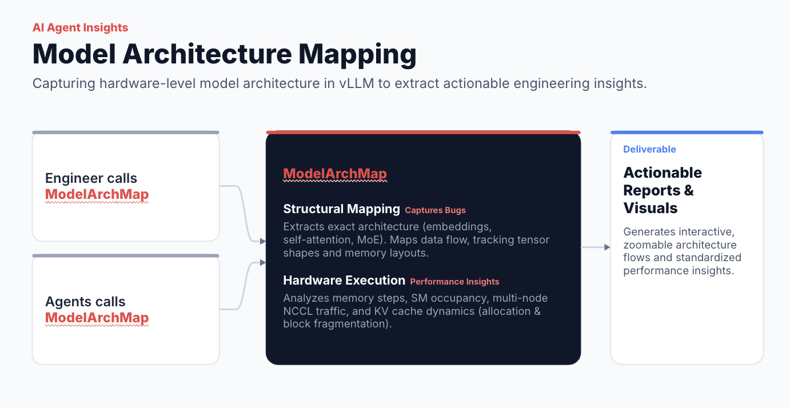
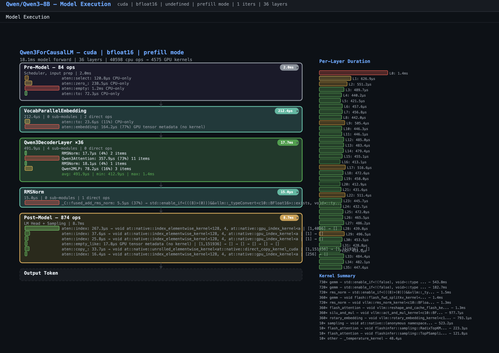
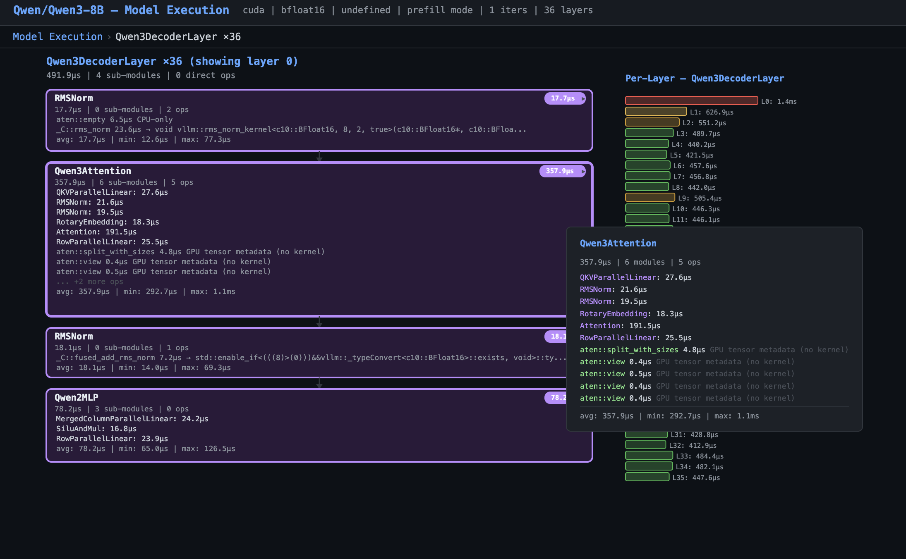
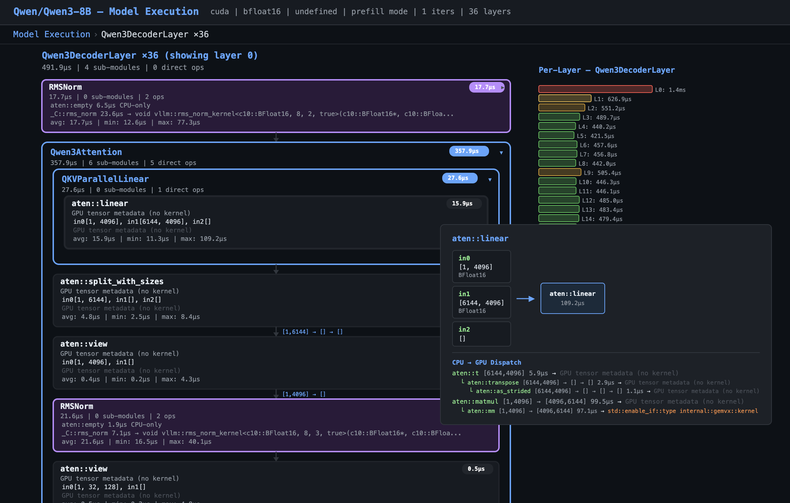

# Hardware-Aware Model Architecture & Execution Mapper

> **Status: Alpha**
> Automated profiling pipeline tested on **Qwen3-8B (DGX SPARK)**. Model-agnostic — no hardcoded architecture names.

## Overview

Manually mapping a model's structural architecture to the underlying hardware execution paths is complex and time-consuming.

This framework dynamically analyzes model topologies and low-level runtime data to map model architectures directly onto GPU execution paths — capturing the full chain from `nn.Module` forward calls through CPU ops to GPU kernel dispatch.

## Pipeline

Two scripts, one HTML viewer:

```
GPU server                         Local machine                    Browser
──────────                         ─────────────                    ───────
walk_model.py ──► model_tree.json
                  profiles/*.json  ──► profiler_to_diagram.py ──► model_execution.json
                                                                      │
                                                                      ▼
                                                                 model_viz.html
```

| File | What it does |
|---|---|
| `walk_model.py` | Walks `nn.Module` tree, captures PyTorch profiler trace with `--with-forward`. Outputs `model_tree.json` + `profiles/*.json` |
| `flow_support.py` | AST-based forward analysis, used by walk_model.py |
| `profiler_to_diagram.py` | DFS on raw Chrome trace — builds module hierarchy, correlates CPU ops to GPU kernels, collapses repeated layers. Outputs `model_execution.json` (~0.3MB) |
| `model_viz.html` | D3.js single-page viewer. Interactive module tree with inline expansion, bottleneck bars, per-layer variance, hover tooltips with CPU→GPU dispatch chain |

### How profiler_to_diagram.py works

1. **Load** raw Chrome trace from `profiles/` + config from `model_tree.json`
2. **DFS tree** — sort events by `(ts, -dur)`, walk once to build time-containment hierarchy from `nn.Module` markers + `cpu_op` events
3. **Correlation map** — `cpu_op.External_id` → `cuda_runtime.correlation` → `kernel` linking
4. **Module tree** — convert DFS nodes to structured format with class, duration, children, ops, GPU dispatch info
5. **Layer collapse** — detect 3+ consecutive siblings with same class → template ×N with per-layer avg/min/max stats
6. **Output** — `model_execution.json` (same format `model_viz.html` reads)

## Key Capabilities

* **Structural Mapping**: Extracts model architectures (embeddings, attention blocks, MLP, MoE routers) and tracks tensor shapes, dtypes, and module hierarchy.
* **Hardware Execution Tracing**: Maps every CPU op to its GPU kernel dispatch — shows cuBLAS GEMM, FlashAttention, fused kernels, and metadata-only ops.
* **Bottleneck Detection**: Duration bars colored green→red by percentage of parent time. Per-layer variance charts highlight outlier layers.
* **Interactive Drill-Down**: Click any module to expand in-place. Hover for CPU→GPU dispatch chain with input shapes and kernel names.

## Visualization Views

| View | What it shows |
|---|---|
| **vTop** | Full model: pre-model ops → module tree (with collapsed decoder layers ×N) → post-model ops. Bottleneck bars on each item. |
| **vMod** | Module detail: sub-modules and ops rendered as blocks with arrows. Click to expand/collapse inline. Per-layer sidebar. |
| **vLayer** | Per-layer op list with variance stats (requires `layer_template` / `per_layer` data — planned). |
| **vStep** | Single op across all layers — bar chart + statistics (requires `per_layer` data — planned). |

## Repository Structure

```
vllm_arch_map/
├── docs/
│   └── images/
│       ├── ModelArchAgent.png
│       ├── qwen3_1.png
│       ├── qwen3_2.png
│       └── qwen3_3.png
├── LICENSE
├── notebooks/
├── README.md
├── samples/
│   ├── model_execution.json
│   ├── model_tree.json
│   ├── model_viz.html
│   └── traces/
│       ├── profiles/
│       │   ├── profiler_out_0.txt
│       │   ├── rank0.1789640479161371744.pt.trace.json
│       │   └── rank0.1789640479161371744.pt.trace.json.gz
│       ├── profiles-0ea472b7-4e84-48f0-988f-54b4e5465830/
│       │   ├── profiler_out_0.txt
│       │   └── rank0.1790649506042672784.pt.trace.json.gz
│       ├── qwen3_serve_trace.nsys-rep
│       └── qwen3_serve_trace.sqlite
├── tests/
└── vllm_arch_map/
    ├── flow_support.py
    ├── __init__.py
    ├── profiler_to_diagram.py
    └── walk_model.py
```

## Quickstart

### Step 1: Serve model with profiling

```bash
vllm serve Qwen/Qwen3-8B \
    --enforce-eager \
    --profiler-config.profiler=torch \
    --profiler-config.torch_profiler_dir=./samples/traces/profiles \
    --profiler-config.torch_profiler_record_shapes=true \
    --profiler-config.torch_profiler_with_stack=true \
    --enable-layerwise-nvtx-tracing \
    2>&1 | tee logs.txt
```

### Step 2: Capture a trace

```bash
curl -X POST localhost:8000/start_profile
curl -H "Content-Type: application/json" localhost:8000/v1/chat/completions \
-d '{"model":"Qwen/Qwen3-8B","messages":[{"role":"user","content":"hello"}]}'
curl -X POST localhost:8000/stop_profile
Produces: profiles/rank0.*.pt.trace.json.gz
```

### Step 3: Extract model tree (on GPU)

```bash
VLLM_ALLOW_INSECURE_SERIALIZATION=1 python vllm_arch_map/walk_model.py Qwen/Qwen3-8B -o samples/model_tree.json --with-forward --profile-dir  ./samples/traces/
# Produces: samples/model_tree.json + /samples/traces/profiles/*.json
```

### Step 4: Build diagram data (locally)

```bash
python3 vllm_arch_map/profiler_to_diagram.py --out_dir samples/ --traces-dir samples/traces
# Produces: samples/model_execution.json
```

### Step 5: View

```bash
python3 -m http.server 8765
open http://localhost:8765/model_viz.html
```

Tested on DGX SPARK + Qwen/Qwen3-8B on baremetal with virtual env.

### Optional: Capture NSYS trace (future integration)

```bash
nsys profile \
    --trace-fork-before-exec=true \
    --cuda-graph-trace=node \
    -t cuda,nvtx,osrt \
    -w true \
    -o samples/traces/qwen3_serve_trace \
    vllm serve Qwen/Qwen3-8B \
    --enforce-eager \
    --enable-layerwise-nvtx-tracing \
    2>&1 | tee logs.txt
```

## Architecture Preview



## Screenshots

Top-level model view:


Decoder layer detail:


Kernel drill-down:


## Roadmap

- [x] Model tree extraction (`walk_model.py` → `model_tree.json`)
- [x] PyTorch profiler trace capture (`--with-forward` flag)
- [x] Simplified pipeline: DFS on Chrome trace (`profiler_to_diagram.py` replaces capture.py + build_graph.py)
- [x] Interactive D3.js viewer with module tree, inline expansion, hover tooltips
- [x] Bottleneck-colored duration bars
- [x] Per-layer variance sidebar (for collapsed repeated layers)
- [ ] Model Generalization: Refactor entry points to support any vLLM model architecture.
- [ ] NSYS data parsing and add the insights to the report and html
- [ ] NCU kernel profiling: SM occupancy, memory bandwidth, block fragmentation, add the insights to the report and html
- [ ] Per-layer drill-down: populate `layer_template` / `per_layer` for vLayer/vStep views
- [ ] Full Model Diagram: Expand model_viz.html to generate full end-to-end model dependency graphs.
- [ ]  **Fusion Mapping & Visual Overlay**: Render piecewise fusion boundaries in `model_viz.html` (e.g., grouping eager sub-nodes into fused piecewise blocks or highlighting candidate clusters)

### Future: Multi-Node & Distributed

- [ ] Tensor Parallelism (TP)
- [ ] Pipeline Parallelism (PP)
- [ ] Data Parallelism (DP)
- [ ] Prefill/Decode (P/D) Disaggregation
- [ ] Expert Parallelism (EP)
