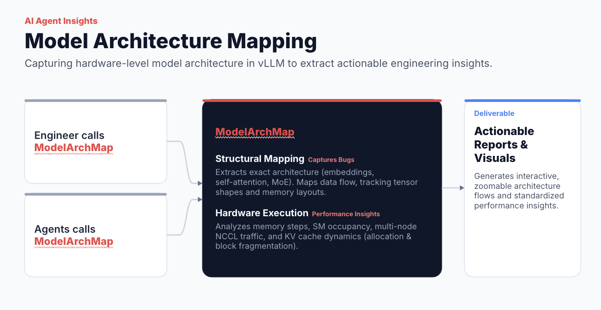
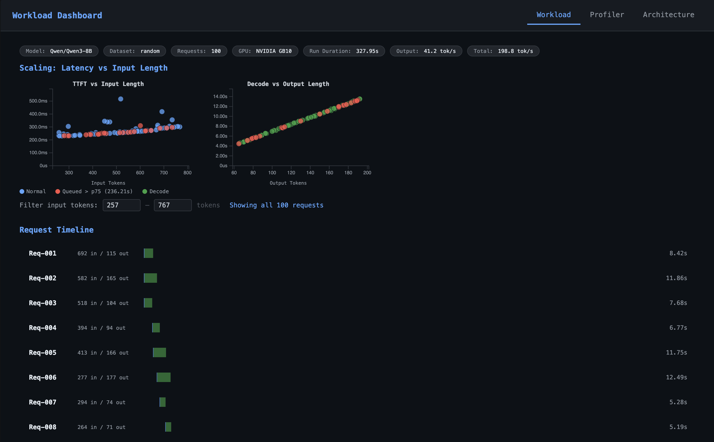
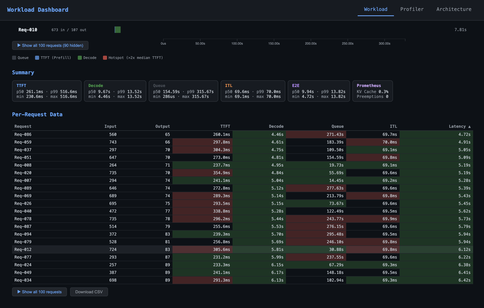
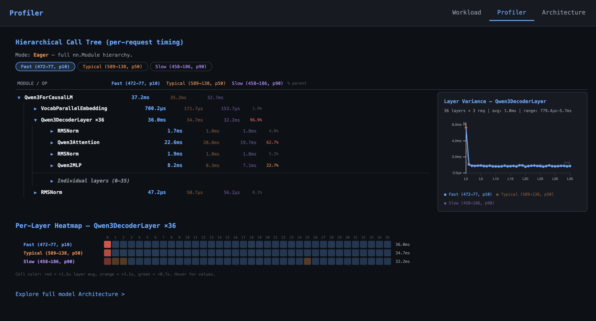
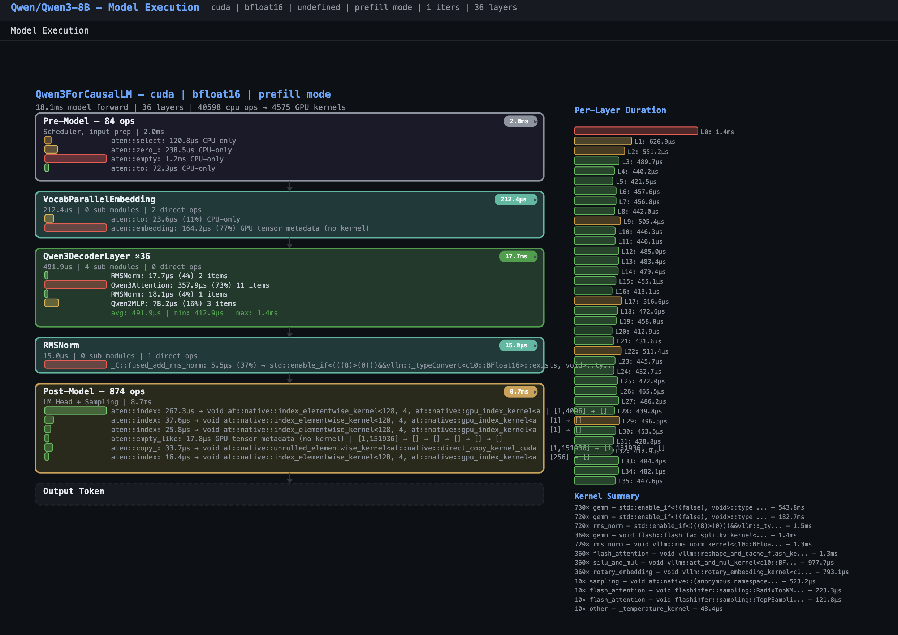
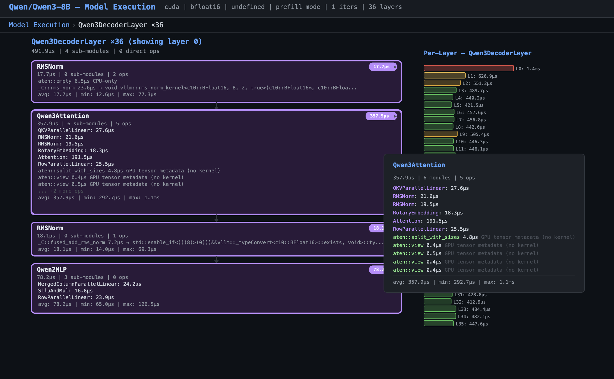
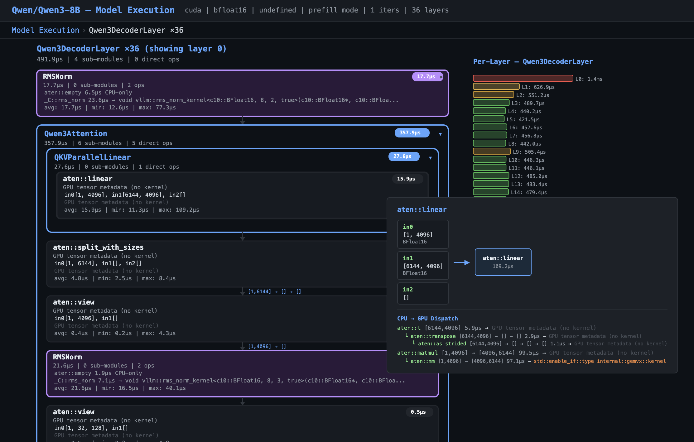

# Hardware-Aware Model Architecture & Execution Mapper

> **Status: Alpha**
> Automated profiling pipeline tested on **Qwen3-8B (DGX SPARK)**. Model-agnostic — no hardcoded architecture names.

## Overview

Manually mapping a model's structural architecture to the underlying hardware execution paths is complex and time-consuming.

This framework dynamically analyzes model topologies and low-level runtime data to map model architectures directly onto GPU execution paths — capturing the full chain from `nn.Module` forward calls through CPU ops to GPU kernel dispatch.

## Architecture

Two independent data paths feed a single HTML viewer with 3 tabs:

```
GPU Host                                              Local Machine
────────                                              ─────────────

PATH A: Model Structure (one-time per model)
─────────────────────────────────────────────
walk_model.py ──► model_tree.json
                  profiles/*.json
                        │
                        ▼
              profiler_to_diagram.py ──► model_execution.json ──► Tab 3: Architecture
                                        (module tree, per-layer         (module drill-down,
                                         timing, kernel mapping)         layer variance bars)

PATH B: Per-Request Workload (per benchmark run)
────────────────────────────────────────────────
vllm serve MODEL ──────┐
                        │
                   vllm bench serve ──► benchmark JSON     curl :8000/metrics
                        │               (per-request            │
                        │                TTFT, ITL,             │
                        │                latency)               │
                        ▼                    ▼                  ▼
                     benchmark JSON    prometheus dump
                        │                    │
                        └────────────────────┘
                        ▼
              parse_workload.py ──► workload_data.json ──► Tab 1: Workload Dashboard
                                    (per-request timing,       (scatter plots, timeline,
                                     summary stats)             sortable table, CSV)

PATH C: Per-Request Profiling (auto-picks representatives from workload)
────────────────────────────────────────────────────────────────────────
profile_serve.py MODEL
  --workload-json workload_data.json
  (offline vllm.LLM,
   picks Fast/Typical/Slow
   by latency percentile,
   torch.profiler per prompt)
        │
        ▼
  request_001.json      (Chrome trace per request:
  request_002.json       full nn.Module → op → kernel
  request_003.json       hierarchy with real timing)
  request_metadata.json  (labels: Fast/Typical/Slow + token counts)
        │
        ▼
  profiler_to_diagram.py ──► per_request_profiles.json ──► Tab 2: Profiler
    --per-request-dir         (per-request module tree,         (hierarchical call tree,
                               per-layer timing,                 hotspot detection,
                               kernel correlation)               per-layer variance)
```

| File | What it does |
|---|---|
| `walk_model.py` | Walks `nn.Module` tree, captures PyTorch profiler trace with `--with-forward`. Outputs `model_tree.json` + `profiles/*.json` |
| `flow_support.py` | AST-based forward analysis, used by walk_model.py |
| `profiler_to_diagram.py` | DFS on raw Chrome trace — builds module hierarchy, correlates CPU ops to GPU kernels, collapses repeated layers. Outputs `model_execution.json` (~0.3MB) |
| `profile_serve.py` | Offline per-request profiling using `vllm.LLM`. Profiles N prompts individually with `torch.profiler`. With `--workload-json`, auto-picks Fast/Typical/Slow representatives from workload data |
| `parse_workload.py` | Merges benchmark JSON + Prometheus metrics into `workload_data.json`. Auto-detects layer count from model config |
| `model_viz.html` | D3.js single-page viewer with 3 tabs. Loads JSON files. All data-driven, works for any model/GPU |

### What each data source provides

| Source | Per-request? | What it gives |
|---|---|---|
| Benchmark JSON | Yes | TTFT, decode time, queue time, ITL, input/output lengths per request |
| Prometheus | No (aggregate) | Server-side histograms: prefill, decode, queue sums |
| model_execution.json | No (one run) | nn.Module tree structure, op→kernel mapping, per-layer profiler timing |
| per_request_profiles.json | Yes | Full nn.Module→op→kernel hierarchy per request with real timing, per-layer variance |

### How profiler_to_diagram.py works

1. **Load** raw Chrome trace from `profiles/` + config from `model_tree.json`
2. **DFS tree** — sort events by `(ts, -dur)`, walk once to build time-containment hierarchy from `nn.Module` markers + `cpu_op` events
3. **Correlation map** — `cpu_op.External_id` → `cuda_runtime.correlation` → `kernel` linking
4. **Module tree** — convert DFS nodes to structured format with class, duration, children, ops, GPU dispatch info
5. **Layer collapse** — detect 3+ consecutive siblings with same class → template ×N with per-layer avg/min/max stats
6. **Output** — `model_execution.json` (same format `model_viz.html` reads)

## Key Capabilities

* **Structural Mapping**: Extracts model architectures (embeddings, attention blocks, MLP, MoE routers) and tracks tensor shapes, dtypes, and module hierarchy.
* **Hardware Execution Tracing**: Maps every CPU op to its GPU kernel dispatch — shows cuBLAS GEMM, FlashAttention, fused kernels, and metadata-only ops.
* **Bottleneck Detection**: Duration bars colored green→red by percentage of parent time. Per-layer variance charts highlight outlier layers.
* **Interactive Drill-Down**: Click any module to expand in-place. Hover for CPU→GPU dispatch chain with input shapes and kernel names.

## Visualization Views

| View | What it shows |
|---|---|
| **vTop** | Full model: pre-model ops → module tree (with collapsed decoder layers ×N) → post-model ops. Bottleneck bars on each item. |
| **vMod** | Module detail: sub-modules and ops rendered as blocks with arrows. Click to expand/collapse inline. Per-layer sidebar. |
| **vLayer** | Per-layer op list with variance stats (requires `layer_template` / `per_layer` data — planned). |
| **vStep** | Single op across all layers — bar chart + statistics (requires `per_layer` data — planned). |

## Repository Structure

```
vllm_arch_map/
├── docs/
│   └── images/
│       ├── ModelArchAgent.png
│       ├── profiler.png
│       ├── qwen3_1.png
│       ├── qwen3_2.png
│       ├── qwen3_3.png
│       ├── workload_a.png
│       └── workload_b.png
├── LICENSE
├── notebooks/
├── README.md
├── samples/
│   ├── model_execution.json
│   ├── model_tree.json
│   ├── model_viz.html
│   └── traces/
│       ├── profiles/
│       │   ├── profiler_out_0.txt
│       │   ├── rank0.1789640479161371744.pt.trace.json
│       │   └── rank0.1789640479161371744.pt.trace.json.gz
│       ├── profiles-0ea472b7-4e84-48f0-988f-54b4e5465830/
│       │   ├── profiler_out_0.txt
│       │   └── rank0.1790649506042672784.pt.trace.json.gz
│       ├── qwen3_serve_trace.nsys-rep
│       └── qwen3_serve_trace.sqlite
├── tests/
└── vllm_arch_map/
    ├── flow_support.py
    ├── __init__.py
    ├── parse_workload.py
    ├── profile_serve.py
    ├── profiler_to_diagram.py
    └── walk_model.py
```

## Quickstart

All commands run on the GPU host. Replace `$MODEL` with your model (e.g., `Qwen/Qwen3-8B`).

### Tab 2: Profiler (Per-Request Module Breakdown)

Single terminal, offline mode. Produces `per_request_profiles.json`.

`profile_serve.py` runs the model with `vllm.LLM` (offline, no server needed) and profiles each prompt individually using `torch.profiler`. With `--workload-json`, it auto-picks 3 representative requests (Fast p10, Typical p50, Slow p90 by latency) from your workload data, matching their input/output token counts.

`profiler_to_diagram.py --per-request-dir` then reads these raw traces and builds a single merged module tree with per-request timing arrays. The Profiler tab shows the module tree with timing columns for each representative — you can immediately see which modules scale badly with input length.

**Why compress to JSON?** Raw Chrome traces are 50-100 MB each (171K+ events for Qwen3-8B). The processed `per_request_profiles.json` is ~1 MB — only the module tree structure, timing, and kernel mappings that the viewer needs. This makes SCP fast and the browser responsive.

```bash
# Option A: Auto-pick representatives from workload data (recommended)
python vllm_arch_map/profile_serve.py $MODEL \
    --workload-json samples/workload_data.json

# Option B: Manual profiling with custom prompts
python vllm_arch_map/profile_serve.py $MODEL \
    --num-prompts 3 --input-len 1024

# Verify traces were generated
ls traces/per_request/request_*.json*

# Process: build merged module tree with kernel correlation
python vllm_arch_map/profiler_to_diagram.py \
    --per-request-dir traces/per_request --out_dir samples/
```

### Tab 1: Workload Dashboard

Two terminals. Produces `workload_data.json`.

Run `vllm serve` with a benchmark client to capture per-request TTFT, decode, queue, and ITL timing. Prometheus provides server-side aggregate metrics. `parse_workload.py` merges everything into one JSON.

```bash
# Terminal 1: start vLLM server
vllm serve $MODEL --max-model-len 8192

# Terminal 2: wait for "Uvicorn running on ..." then run benchmark
vllm bench serve --backend vllm --model $MODEL \
    --endpoint /v1/completions --dataset-name random \
    --num-prompts 100 --max-concurrency 3 \
    --random-input-len 512 --random-output-len 128 \
    --random-range-ratio 0.5 \
    --save-result --save-detailed --result-dir benchmark_outputs/

# Terminal 2: capture Prometheus metrics (server still running)
curl -s http://localhost:8000/metrics > benchmark_outputs/prometheus.txt

# Terminal 1: Ctrl+C to stop server

# Process: merge benchmark JSON + Prometheus
python vllm_arch_map/parse_workload.py \
    --bench benchmark_outputs/*.json \
    --prometheus benchmark_outputs/prometheus.txt \
    -o samples/workload_data.json
```

### Tab 3: Architecture (one-time per model)

Single terminal. Produces `model_execution.json`.

`walk_model.py` walks the `nn.Module` tree and captures a PyTorch profiler trace. The trace is saved as a compressed `.json.gz` file (raw Chrome trace format). `profiler_to_diagram.py` reads it directly (no manual decompression needed) and builds the module hierarchy with kernel mappings.

```bash
# 1. Walk model tree + capture profiler trace
VLLM_ALLOW_INSECURE_SERIALIZATION=1 python vllm_arch_map/walk_model.py $MODEL \
    -o samples/model_tree.json --with-forward --profile-dir ./samples/traces/

# 2. Process: build module tree with kernel correlation + layer collapse
python vllm_arch_map/profiler_to_diagram.py \
    --out_dir samples/ --traces-dir samples/traces
```

### View (host/local machine)

```bash
python3 -m http.server 8765 --directory samples
open http://localhost:8765/model_viz.html
```

Tested on DGX SPARK + Qwen/Qwen3-8B.

## Architecture Preview



## Screenshots

### Workload Dashboard
Scatter plots (TTFT vs Input Length, Decode vs Output Length), data-driven queue threshold coloring, and input token filter.



Request timeline (Gantt chart with real start times), summary stats (p50/p99), Prometheus metrics (KV cache, preemptions), and color-coded sortable table with CSV download.



### Profiler
Per-request module breakdown: hierarchical call tree with per-request timing columns (Fast/Typical/Slow representatives auto-picked from workload data), per-layer heatmap, and layer variance chart. Mode indicator shows eager/compiled.



### Architecture
Top-level model view with per-layer duration sidebar:



Decoder layer detail:


Kernel drill-down:


## Roadmap

- [x] Model tree extraction (`walk_model.py` → `model_tree.json`)
- [x] PyTorch profiler trace capture (`--with-forward` flag)
- [x] DFS Chrome trace pipeline (`profiler_to_diagram.py`)
- [x] Interactive D3.js viewer with module tree, inline expansion, hover tooltips
- [x] Bottleneck-colored duration bars + per-layer variance sidebar
- [x] Per-request workload dashboard (`parse_workload.py` + `vllm bench serve`)
- [x] Auto-pick Fast/Typical/Slow representatives from workload data (`--workload-json`)
- [x] Per-request hierarchical profiling (`profile_serve.py` + merged tree)
- [x] Prometheus metrics integration
- [x] Auto-detect layer count from model config
- [x] Per-layer drill-down with variance chart (collapsed ×N + individual layer expansion)
- [ ] Eager vs Compile diff view
- [ ] NSYS + NCU kernel profiling: memory bandwidth, compute utilization, bottleneck classification
- [ ] Tensor Parallelism (TP)

# Next quarter: 
- [ ] Inductor fusion detector (parse TORCH_COMPILE_DEBUG report)
- [ ] Scheduler MetaData
- [ ] Full end-to-end model dependency graphs

### Future: Multi-Node & Distributed
- [ ] Pipeline Parallelism (PP)
- [ ] Data Parallelism (DP)
- [ ] Prefill/Decode (P/D) Disaggregation
- [ ] Expert Parallelism (EP)
